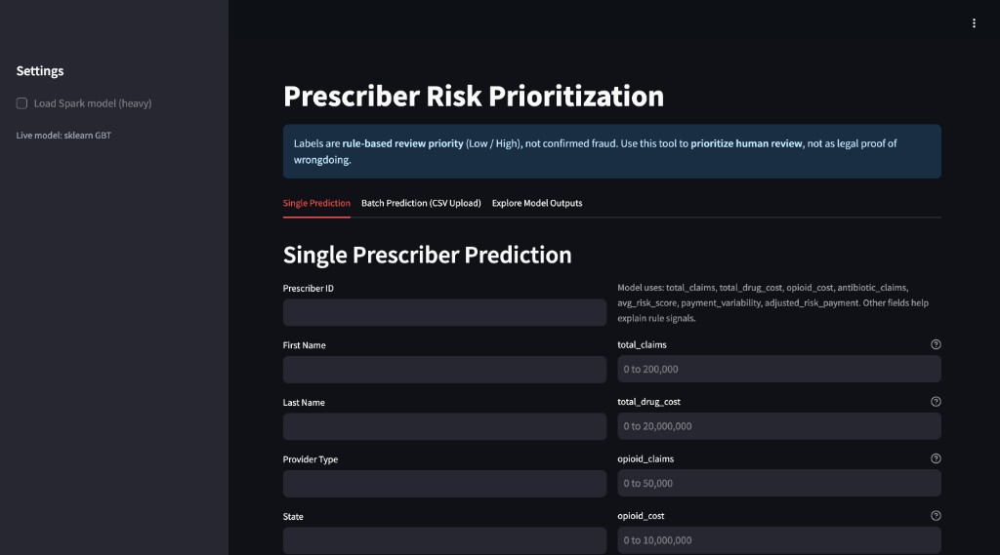
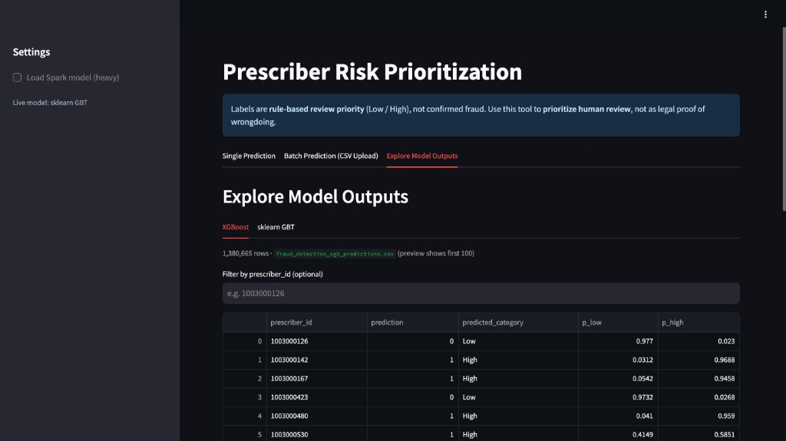

# Prescriber Risk Prioritization Platform

Rule-based **Medicare Part D prescriber review priority** (Low / High) using CMS prescribing + Open Payments data, PySpark ETL, calibrated ML, and a public Streamlit demo.

> **Disclaimer:** Labels are **not confirmed fraud** — they prioritize human review only.

**Repository:** [github.com/Architgupta20/Fraud-Detection-App](https://github.com/Architgupta20/Fraud-Detection-App)

## Live demo

**[https://fraud-detection-app-9pen.onrender.com/](https://fraud-detection-app-9pen.onrender.com/)**

| Single prediction | Explore outputs (~1.38M prescribers) |
|-------------------|--------------------------------------|
|  |  |

Render **free tier** sleeps after ~15 min idle; first visit may take 30–60s to wake.

---

## Highlights

| | |
|--|--|
| **Scale** | ~1.38M prescribers after ETL |
| **Rules** | v2.1 additive points → **Low** (0–1 pts) / **High** (≥ 2 pts) |
| **ML** | 80/20 holdout; XGB 91.4% acc / sklearn 90.7% on validation |
| **Stack** | PySpark, pandas, XGBoost, sklearn, Streamlit, Docker, Render |
| **Phase** | **Phase 1 complete** — live demo + pipeline + training |

---

## What is in this repo (Git)

| Included | Not in Git (local only) |
|----------|-------------------------|
| `risk_rules.py`, `run_pipeline.py`, `config.py` | CMS raw CSVs (~18 GB) |
| `Models/train_*.py`, `gbt_sklearn.pkl` | `xgb_calibrated.pkl` |
| `Outputs/Reports/streamlit_app.py` | Full scored CSV (~400 MB) |
| `fraud_detection_gbt_sklearn_predictions.csv` | XGB predictions CSV (regenerate with `train_xgb.py`) |
| `sample_batch_input.csv`, `Dockerfile`, `render.yaml` | Enriched / intermediate ETL files |

---

## Architecture

```
CMS CSVs (local)
    → run_pipeline.py (clean → aggregate → features → score)
    → fraud_risk_scored_prescribers.csv
    → train_xgb.py / train_sklearn.py
    → streamlit_app.py  →  Render (Docker)
```

**Single source of truth:** `risk_rules.py` (rules, labels, `ML_FEATURE_COLS`). Details: [docs/RISK_RULES.md](docs/RISK_RULES.md).

---

## Quick start (local)

```bash
git clone https://github.com/Architgupta20/Fraud-Detection-App.git
cd Fraud-Detection-App
python3 -m venv .venv && source .venv/bin/activate
pip install -r requirements.txt
pip install -r requirements-spark.txt   # ETL only; Java 17+
```

1. **Data** — download CMS files per [docs/DATA.md](docs/DATA.md) into `Data/Original_Datasets/`
2. **ETL** — `export BASE_DIR="$(pwd)" && python run_pipeline.py all`
3. **Train** — `python Models/train_xgb.py --sample-frac 1.0 --strict-rules-version` (and sklearn)
4. **App** — `streamlit run Outputs/Reports/streamlit_app.py`

Preview CSVs safely: `python Scripts/inspect_csv.py scored --rows 5`

---

## Model results (v2.1, full data)

| Model | Val accuracy | Macro-F1 | High recall |
|-------|--------------|----------|-------------|
| XGBoost (calibrated) | 91.4% | 0.897 | 85.9% |
| sklearn GBT | 90.7% | 0.888 | 85.0% |

Train/val split: **80% / 20%** by hashed `prescriber_id`.

---

## Deploy

**Docker (local)**

```bash
docker build -t prescriber-risk-app .
docker run --rm -p 8502:8501 prescriber-risk-app   # use 8502 if 8501 busy
```

Open **http://localhost:8502** (not `0.0.0.0`).

**Render** — connect repo, use `render.yaml`. Env: `BASE_DIR`, `MODEL_DATA_DIR`, `SKLEARN_MODEL_PATH` (pre-set).

---

## Repository layout

```
├── risk_rules.py              # Rules + ML features
├── run_pipeline.py            # PySpark ETL
├── Models/                    # train_xgb, train_sklearn, gbt_sklearn.pkl
├── Outputs/Reports/           # Streamlit app
├── Data/Model_Data/           # sklearn predictions + sample_batch_input.csv
├── docs/                      # DATA, RISK_RULES, images, WORK_PLAN
├── Dockerfile, render.yaml
└── requirements.txt
```

---

## Documentation

| Doc | Topic |
|-----|--------|
| [docs/DATA.md](docs/DATA.md) | CMS downloads |
| [docs/RISK_RULES.md](docs/RISK_RULES.md) | Scoring rules v2.1 |
| [docs/LABEL_LEAKAGE.md](docs/LABEL_LEAKAGE.md) | ML feature boundaries |
| [docs/SPARK.md](docs/SPARK.md) | PySpark 3.5.5 / Python 3.13 |
| [docs/WORK_PLAN.md](docs/WORK_PLAN.md) | Phase 1 done → Phase 2 |

---

## Roadmap (Phase 2+)

FastAPI + Postgres, analyst queue, faster Explore API, OIG validation.

---

## Ethics

Public CMS provider data — do not present model output as proof of fraud.

## License

MIT — see [LICENSE](LICENSE).

## Author

LTI Mindtree internship — healthcare analytics / M.Tech review.
